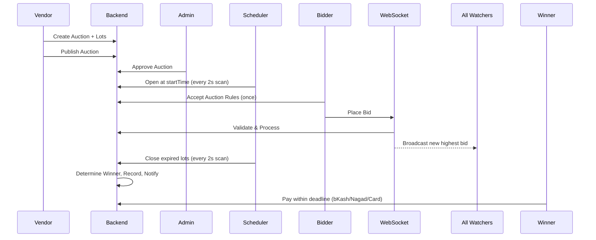

# AtomDrops Marketplace OS — Master Working Mechanism

## 1. Project Overview

AtomDrops Marketplace OS is a full-stack, multi-vendor marketplace platform tailored for Bangladesh. It unifies four commerce verticals into a single system:

- **New Product Sales** — Traditional e-commerce marketplace
- **Used/Pre-owned Listings** — Peer-to-peer second-hand sales with offer negotiation
- **Repair Services** — Customer-to-technician service matching with quoting
- **Live Auctions** — Real-time bidding engine with multiple auction types

The system operates on BDT (Bangladeshi Taka), supports Dhaka-specific shipping zones, and integrates local payment methods (bKash, Nagad, COD).

---

## 2. Tech Stack

| Layer | Technology |
|---|---|
| Backend | Java 21, Spring Boot 4, Spring Data JPA, Spring Security |
| Database | PostgreSQL 15 (Supabase) |
| Real-time | STOMP WebSocket (SockJS) + Server-Sent Events (SSE) |
| Frontend | React 19, TypeScript 6, Vite 8, Tailwind CSS 4 |
| State | TanStack React Query 5, Axios |
| Forms | React Hook Form + Zod |
| Auth | Session-based (JSESSIONID HTTP-only cookie) |
| File Storage | Supabase Storage (bucket: `atomdrops`) |
| Build | Maven (backend), Vite (frontend) |

---

## 3. User Roles & Permissions

| Role | Capabilities |
|---|---|
| **CUSTOMER** | Browse products, buy new/used items, bid in auctions, create repair requests, leave reviews |
| **VENDOR** | All customer capabilities + create/edit products, manage inventory, run auctions, manage orders, respond to questions |
| **TECHNICIAN** | View open repair requests, submit quotes, complete bookings, manage service profile |
| **ADMIN** | Full system moderation: users, auctions, products, orders, reports, returns, fraud flags, platform settings, audit logs, data export |

Users can upgrade roles (Customer → Vendor or Technician) by paying a one-time fee.

---

## 4. Feature Working Mechanisms

### 4.1 Authentication & User Management

- Users register with email, password, display name, and optional role selection.
- Auth is **session-based**: login establishes a JSESSIONID HTTP-only cookie; no JWT tokens.
- Auth state is cached on the frontend via React Query with 5-minute stale time and persisted to localStorage.
- Each user has a **Trust Score** (initial: 50). It adjusts dynamically based on behavior (cancellations, disputes, non-payment, etc.).
- Users manage their profile (avatar, bio, phone, location, gender, DOB) and addresses (CRUD, default address selection).

### 4.2 Product Marketplace (New Items)

- Vendors create products with name, description, price, category, images, variants, and stock levels.
- Inventory tracking supports low-stock thresholds.
- Shipping is configurable per product: FREE or PAID, with separate rates for Inside Dhaka (60 BDT) and Outside Dhaka (100 BDT).
- Customers browse by category, filter by price range, ask questions, leave ratings/reviews, and manage a wishlist.
- Vendors respond to product questions.

### 4.3 Used / Pre-owned Listings

- Customers list used items with title, description, price, condition (Like New / Good / Fair / Needs Repair), warranty flag, images, video, item history, and repair records.
- Buyers make **offers** on listings. Sellers can accept, counter, or reject. Offers support threaded messaging for negotiation.
- Used items can be added to cart and checked out alongside new products.

### 4.4 Repair Services

- Technicians set up profiles with specialization, bio, service area, pickup availability, and social links.
- Customers create **repair requests** describing the issue, optionally requesting pickup pickup, and attaching media.
- Technicians browse open requests and submit **quotes** (price + repair plan).
- Customers review quotes and **accept** one, which schedules a date.
- Technicians mark the booking **completed** after service delivery.

### 4.5 Auction System (Core Differentiator)

**Auction Types:**
- **STANDARD** — Fixed duration, highest bid wins

**Lifecycle:**
1. **CREATED** (vendor draft) → vendor publishes
2. **APPROVED/REJECTED** (admin moderation)
3. **PREPARING** (pre-countdown phase)
4. **ACTIVE** (bidding open)
5. **CLOSED** (ended)
6. Additional states: FROZEN, SUSPENDED, CANCELLED (admin actions)

**Lots:** Each auction can contain multiple lots (individual items). Each lot has its own starting price, reserve price, minimum bid increment, current bid, and status tracking.

**Bidding Rules (enforced server-side):**
- Bid must be ≥ current bid + minimum increment
- Vendor cannot bid on own auction
- Bidder must accept Auction Rules agreement (one-time)
- Bidder must not be restricted by the vendor
- Bidder account must be ACTIVE
- Bidder cannot already be the highest bidder
- When outbid, the previous winner is automatically notified

**Real-time Engine:**
- **STOMP WebSocket** (`/ws/auction`) — Bid placement and live broadcast to all watchers
- **SSE** (`/api/auctions/{id}/events`) — Auction status change broadcasts
- Frontend auto-refreshes every 1.5–5 seconds for active auctions

**Anti-sniping (Auction Extension):**
- If a bid is placed within the extension window before close, the lot's end time is extended automatically, preventing last-second sniping.

**Winner Determination:**
- A **scheduled task runs every 2 seconds** scanning for expired lots.
- When a lot closes, the highest bidder is declared winner.
- If the reserve price was not met (reserve auctions), no winner is declared.
- A payment deadline is set (configurable, default 48 hours).
- Winner is notified via in-app notification ("You won!").

**Non-payment:** Tracks non-payment counts per user. After a configurable threshold (default: 2), the user gets restricted or banned from future auctions.

### 4.6 Shopping Cart & Checkout

- Cart states: ACTIVE → PENDING_CHECKOUT → COMPLETED / CANCELLED / ABANDONED / EXPIRED.
- Supports adding both new products and used listings.
- **Coupons** (PERCENT or FLAT discount types).
- Shipping calculated based on Inside/Outside Dhaka rates.
- Checkout creates an Order with order items, generates VendorCommission records per item, and auto-creates an ORDER conversation between buyer and each vendor for post-order chat.

### 4.7 Order Management

**Status Lifecycle (vendor-managed):**
PLACED → APPROVED → PACKED → SHIPPED → DELIVERED

- Customers can cancel within 24 hours before shipping (triggers trust score penalty if cancelled before vendor approval).
- Vendors can reject orders (PLACED → REJECTED).
- Auto-invoice generation: `INV-{timestamp}-{orderId}`.
- In-app notifications for every status change (NEW_ORDER, ORDER_APPROVED, ORDER_SHIPPED, etc.).
- Email notifications via Spring Mail (Gmail SMTP).

### 4.8 Payment System

| Method | Behavior |
|---|---|
| **bKash / Nagad / Card** | Online payment — order marked APPROVED immediately on confirmation |
| **COD** | Cash on Delivery — order stays PLACED until vendor marks delivered |

Transaction references are generated per method (BKS-xxx, NGD-xxx, CRD-xxx, TXN-xxx). Invoices are created per payment. Admins can process refunds (status → REFUNDED). Vendor commissions are tracked per order item.

### 4.9 Admin Dashboard & Moderation

- **User management:** Search, ban, suspend, delete, update roles, reset passwords, view activity logs.
- **Auction moderation:** Approve, reject, cancel, freeze, suspend, force-close.
- **Product moderation:** Hide, delete, override fields.
- **Used listing moderation:** Hide, delete, override.
- **Order management:** Status override, force-cancel.
- **Fraud flags:** View OPEN/RESOLVED flags, resolve.
- **Reports:** Resolve or dismiss user-submitted reports.
- **Returns:** Approve or reject return requests.
- **Platform settings:** Configure trust thresholds, auction parameters, commission rates, shipping defaults.
- **Analytics dashboard:** Total users, auctions, products, orders, open reports, pending returns, daily snapshots.
- **System notifications:** Create/update/delete announcements targeted by role.
- **Audit logging:** Every admin action is logged with old/new data diff.
- **Data export:** Export users, products, orders, auctions, payments, used-listings, service-listings as data.
- **Content moderation:** Delete reviews, bids, messages, and conversations.

### 4.10 Trust & Fraud Detection System

- **Trust Score:** Dynamic score per user (initial: 50). Decreases for cancellations, disputes, chargebacks, etc. Increases for successful completions.
- **Risk Signals Monitored:**
  - Repeated bidding between same users (shill bidding)
  - User frequently bids on only one seller's auctions
  - Bidder never wins despite high bid volume (300+ bids, 0 purchases)
  - Rapid bidding spikes (price jumps within seconds)
  - Price manipulation rings (groups coordinating artificially)
- **Penalty Escalation:** Warning → Temporary restriction → Auction ban
- **Bidder Restrictions:** Vendors can restrict specific bidders from their auctions.
- **Fraud Flags:** Admin-reviewed suspicious activity records.
- **User Red Flags:** Admins attach notes to user accounts documenting concerns.
- **Auto-suspend:** Users are auto-suspended if trust score drops below threshold (default: 10).

---

## 5. Automation & QA

| Script | Purpose |
|---|---|
| `qa-e2e-smoke.mjs` | Full end-to-end smoke test: auth, profiles, addresses, upgrades, products, cart, orders, payments, used listings, offers, repair, auctions, bidding, winner determination, admin actions, fraud flags, reports, returns, notifications |
| `qa-seed-countdown-auction.mjs` | Seeds an active FLASH auction with a 5-minute countdown for UI demonstration |
| `query-orders.mjs` | Diagnostic: queries recent orders, payments, and status counts |

---

## 6. Authentication Flow (End-to-End)

1. User submits registration payload → Backend creates User + TrustScore + assigns roles → Sets session cookie
2. User logs in → Session established → Frontend caches auth state
3. All subsequent API calls include the session cookie automatically (Axios `withCredentials: true`)
4. Logout clears session on both client and server

---

## 7. Auction Flow (Full Cycle)

---

## 8. Key Design Decisions

- **Session auth over JWT** — Simpler server-side control; sessions can be invalidated instantly.
- **Dual real-time (WebSocket + SSE)** — WebSocket for bidirectional bid placement; SSE for server-to-client status broadcasts. Provides fallback options.
- **Bangladesh-first** — BDT currency, Dhaka shipping zones, bKash/Nagad payment methods reflect the target market.
- **Modular verticals** — Product marketplace, used listings, repair services, and auctions share core infrastructure (users, auth, payments, notifications) but operate independently.
